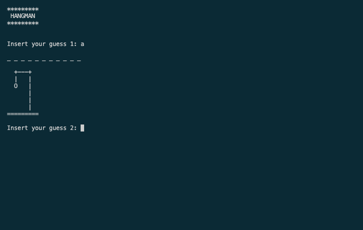

# Hangman Game

A simple Hangman game written in C.



## Table of Contents
- [Features](#features)
- [Project Highlights](#project-highlights)
- [Getting Started](#getting-started)
  - [Prerequisites](#prerequisites)
  - [Building](#building)
- [How to Play](#how-to-play)
- [In Progress](#in-progress)
- [Acknowledgments](#acknowledgments)
- [License](#license)

## Features

- Randomly selects a word from a list.
- Classic Hangman gameplay.
- Visual representation of the hangman.
- Tracks correct and incorrect guesses.
- Game over and victory conditions.
- Input validation for alphabetic characters.

## Project Highlights

- **Dynamic Memory Allocation**: The game dynamically allocates memory for the word list, allowing flexibility in the number of words and their lengths.
- **Random Word Selection**: Words are selected randomly from the list, adding variety to each game.
- **Input Validation**: The game enforces input validation to ensure that only valid characters are accepted.
- **Visual Representation**: The hangman's progress is visually represented with ASCII art as the game unfolds.
- **Error Handling**: The game includes error handling and provides user-friendly error messages.
- **User Interaction**: The game involves user interaction for guessing letters.

## Getting Started

### Prerequisites

Before you begin, ensure you have met the following requirements:

- You have a C compiler (e.g., GCC) installed.

### Building

1. Clone the repository:

   ```sh
   git clone https://github.com/anacletu/hangman.git
   ```

2. Build the game:

   ```sh
   gcc hangman.c -o hangman
   ```

3. Run the game:

   ```sh
   ./hangman
   ```

## How to Play

1. Guess letters one at a time.
2. The game will display your correct guesses and the hangman's status.
3. You win if you guess the word or lose if the hangman is complete.

## In Progress

1. Improving visual art for victory and game-over.
2. Adding levels and different word-banks.
3. Show secret word at the end in case of game-over.

## Acknowledgments

- [Adapted Hangman ASCII art from this source](https://gist.github.com/chrishorton/8510732aa9a80a03c829b09f12e20d9c).

## License

This project is licensed under the MIT License - see the [LICENSE](LICENSE) file for details.